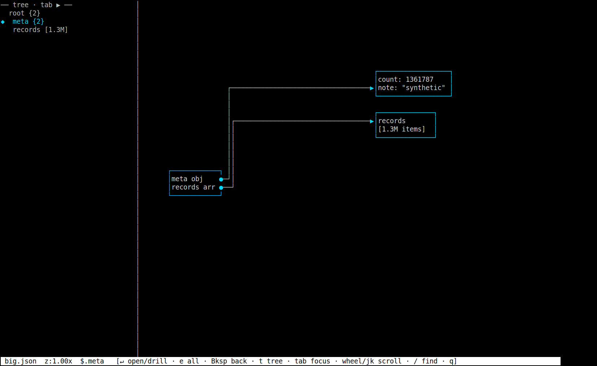
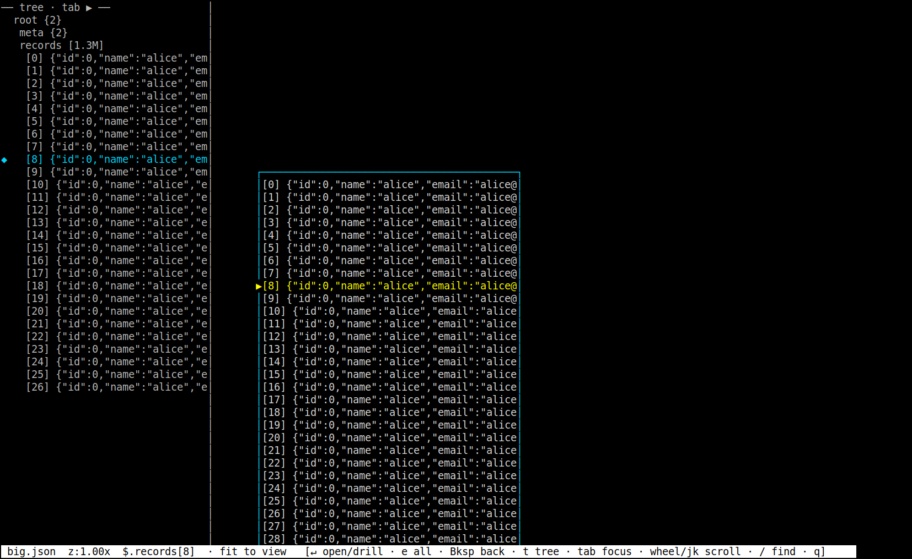
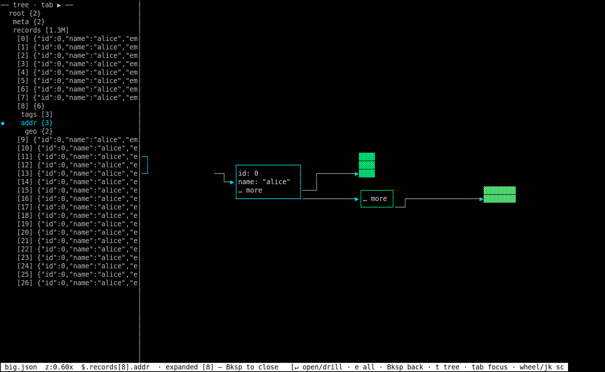
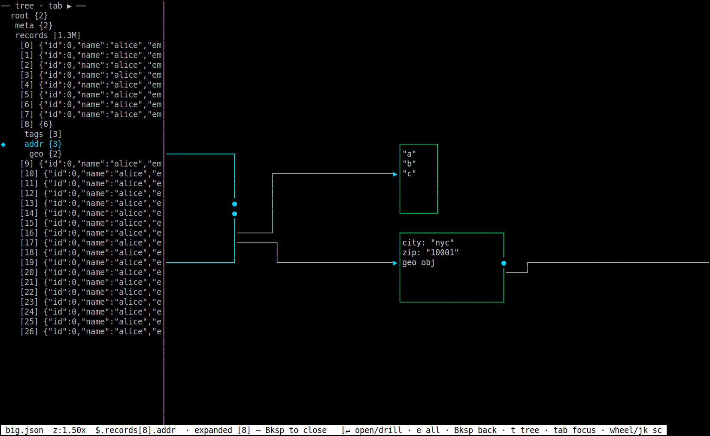
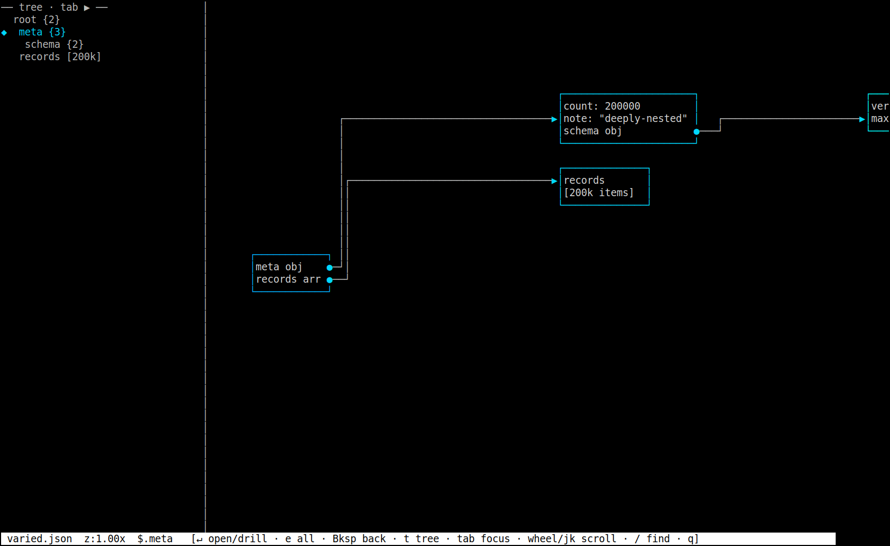
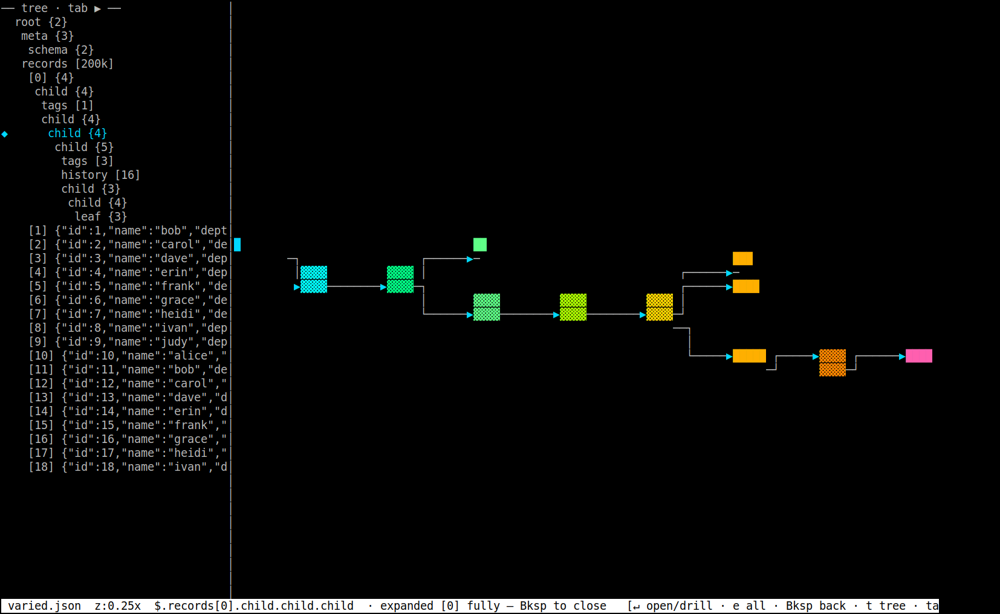
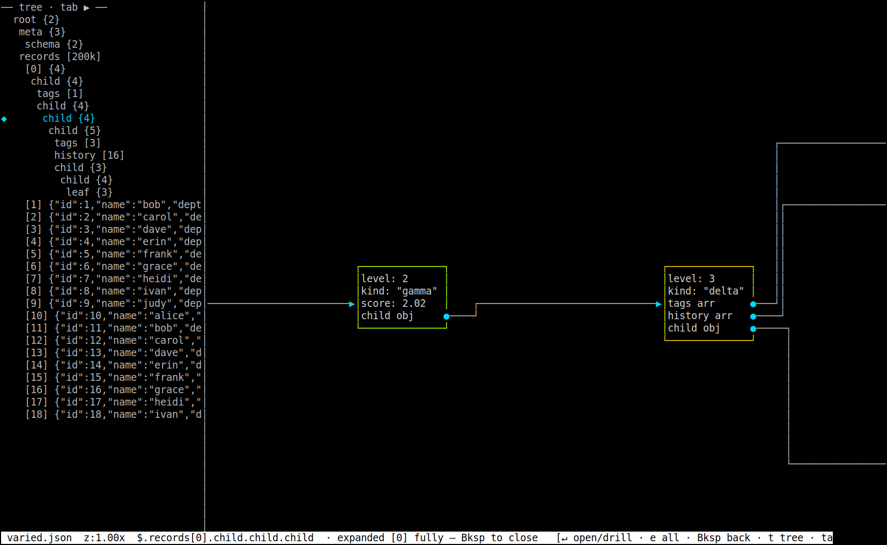

# canvas — a JSON Crack‑style node‑link diagram viewer for *very large* JSON, in your terminal

> **TL;DR** — Open a 1 GB JSON file as an interactive, pannable, zoomable node‑link
> diagram, in a plain terminal, in a fraction of a second. Pure **Bash + GNU awk** —
> nothing to install beyond a stock Ubuntu. It only ever reads the slice on screen,
> so memory stays flat and a 200 MB file and a 1 GB file open equally fast.

[![canvas demo — drill into a 200k‑element array, goto records[99999], expand‑all a 30‑level nested spine, semantic‑zoom LOD, and the linked tree outline](docs/img/demo.gif)](docs/img/demo.gif)

```bash
# clone, generate a 200 MB test file, and open it — no install step
git clone https://github.com/mhmmdbdrhmd/jsoncanvas
cd jsoncanvas
tools/gen.sh big.json 200
./canvas big.json
```

**Why it's different:** every other JSON tool assumes that to show you *any* of a file it
must first read *all* of it. `canvas` doesn't — it locates structure by byte offset, reads
only the window you're looking at, and draws that window as a diagram. Semantic‑zoom
level‑of‑detail, a linked tree outline, drill‑in, `path`‑goto, and `grep` search are all
bounded by what's on screen, never by the size of the file.

| | |
|---|---|
| **Opens** | 200 MB / 1.36M records → first frame in **~0.16 s** |
| **Memory** | flat, regardless of file size |
| **Deps** | `bash`, `gawk`, coreutils, `grep` — all preinstalled on Ubuntu |
| **Install** | none |

---

## Table of contents

- [Why](#why)
- [Feature highlights](#feature-highlights)
- [Gallery](#gallery)
- [Requirements](#requirements)
- [Quick start](#quick-start)
- [Keybindings](#keybindings)
- [Generating test data](#generating-test-data)
- [Non‑interactive / scripting modes](#non-interactive--scripting-modes)
- [How it works](#how-it-works)
  - [Bash conducts, awk is the engine](#bash-conducts-awk-is-the-engine)
  - [The two awk programs](#the-two-awk-programs)
  - [The wire protocol](#the-wire-protocol)
  - [The camera](#the-camera)
  - [The node model](#the-node-model)
  - [Virtualized huge containers](#virtualized-huge-containers)
  - [The on‑disk index](#the-on-disk-index)
  - [Search](#search)
  - [Path goto](#path-goto)
  - [The tree side panel](#the-tree-side-panel)
- [Performance](#performance)
- [Design invariants (things that will bite you)](#design-invariants-things-that-will-bite-you)
- [Project layout](#project-layout)
- [Known issues & help wanted](#known-issues--help-wanted)
- [Testing & development](#testing--development)
- [Roadmap](#roadmap)
- [`jsonview` — the v1 browser](#jsonview--the-v1-browser)
- [License](#license)

---

## Why

Open a multi‑hundred‑megabyte JSON file in a text editor and it freezes; pipe it through a
pretty‑printer and you scroll through millions of indistinguishable lines; load it into a GUI
JSON viewer and it tries to parse the whole document into memory and dies.

The usual tools all share one assumption: **to show you any of the file, they must first read
all of it.** `canvas` rejects that assumption. It treats a JSON file the way a tiling map
renderer treats the planet — it never loads the whole thing. It locates structure by byte
offset, reads only the small window you are looking at, and draws that window as a diagram.
The result is an interactive structural map of a file far larger than RAM, in a plain
terminal, with zero dependencies.

---

## Feature highlights

- **Node‑link diagram on an infinite canvas.** Objects and arrays are boxes; nesting is
  expressed as edges between boxes laid out left‑to‑right by depth. Pan with the arrow keys
  or `hjkl`, zoom with `+`/`-`.
- **Semantic‑zoom level of detail.** As you zoom out, boxes degrade gracefully from
  full text → a filled bar → a single "minimap" pixel, so the overall shape of a giant
  document stays legible at any scale. Depth is color‑coded.
- **Virtualized huge containers.** A million‑element array is never fanned out into a
  million boxes. It is drawn as a **windowed, scrollable list** that materializes only the
  rows currently under the viewport, seeking to them through a sparse checkpoint map.
- **Drill‑in and expand‑all.** Open a huge list, select one element, and expand *only* that
  element into its own node‑link subtree (`↵`), or expand its entire nested structure deeply
  for an overview (`e`).
- **Linked tree outline.** A collapsible indented outline of the model on the left, kept in
  sync with the canvas. Move the cursor in the tree and the canvas re‑centres; the elements
  of an entered huge list are spliced into the outline so the 1M items are navigable there too.
- **Path goto.** Jump to `records[23].child.history[4]` and the viewer walks the model,
  drilling through nested huge lists as needed, and frames the target.
- **`grep`‑backed search.** Find a literal string anywhere in the file; the match is resolved
  back to the exact model node — including the precise element index inside a huge list — and
  the camera jumps there.
- **One‑pass on‑disk index** for instant *cold* deep jumps and search landings, cached to a
  sidecar file beside the JSON.
- **JSONPath breadcrumb** of the current selection in the status bar (e.g. `$.records[15].tags`).
- **Zero install.** Bash, GNU awk, and coreutils. No Python, Node, Go, Rust, or any package
  that is not already on a stock Ubuntu.

---

## Gallery

**Overview.** The root object fanned out into a node‑link diagram, with the linked tree
outline on the left and a JSONPath breadcrumb in the status bar.



**Virtualized huge list.** Entering the `records` array (1.3M elements) renders a windowed,
scrollable list — only the visible rows are read from disk. The selected element is
highlighted, and its JSONPath appears in the status bar.



**Drill‑in with semantic LOD.** Pressing `↵` on the selected element expands it into its own
subtree, framed beside the list. At this zoom its children are below the text threshold, so
they render as colored minimap blocks; the tree outline on the left expands the same element
inline.



**The same drill, zoomed in.** Zoom in and the child containers resolve into readable boxes —
the `tags` array, the `addr` object, and its nested `geo` object, wired by edges.



**Deeply nested, heterogeneous data.** A different generator builds records that are spines of
6–30 nested objects, no two alike, some burying arrays large enough to virtualize themselves.



**Expand‑all over a deep spine.** `e` expands a whole record deeply. The depth color gradient
(cyan → green → yellow → orange → pink) makes the 20‑plus‑level spine readable at a glance even
as a minimap, and the full path is in the outline.



**The deep spine, zoomed in.** Each level carries different keys (`level`, `kind`, `score`,
`tags`, a buried `history` array …); handles (●) mark the container children that branch off.



---

## Requirements

Everything below is preinstalled on a stock Ubuntu; the runtime needs only the first group.

**Runtime**

- `bash` (4+; tested on 5.1)
- `gawk` (GNU awk; tested on 5.1)
- coreutils: `head`, `tail`, `wc`, `tput`, `stty`, `printf`
- `grep` (GNU grep, for search)
- A terminal. 256‑color and a font with box‑drawing glyphs (any modern monospaced font) give
  the best result; on `xterm`/`urxvt` the viewer will optionally shrink the font for more
  resolution (see [`CANVAS_FONT_PT`](#environment-variables)).

**Optional — only for the screenshot/dev harness** (`tools/loop.sh`)

- X11, `xterm`, `xdotool`, and ImageMagick (`import`, `convert`, `identify`)

---

## Quick start

```bash
# make a large test file (200 MB of uniform records) and open it
tools/gen.sh big.json 200
./canvas big.json

# or a deeply nested, heterogeneous file
tools/gen_varied.sh varied.json 1000000
./canvas varied.json
```

`canvas` needs a real TTY to run interactively. For headless / scripted use see
[Non‑interactive modes](#non-interactive--scripting-modes).

### Environment variables

| Variable           | Effect                                                                 |
| ------------------ | ---------------------------------------------------------------------- |
| `CANVAS_FONT_PT=N` | Ask the terminal to shrink its font to *N* pt for more cells (default 8). |
| `CANVAS_NOFONT=1`  | Never touch the terminal font.                                         |
| `CANVAS_DEBUG=1`   | Log mouse/scroll events to stderr.                                     |

---

## Keybindings

| Key(s)                         | Action                                                                                  |
| ------------------------------ | --------------------------------------------------------------------------------------- |
| arrows / `h` `j` `k` `l`       | Pan the camera                                                                          |
| mouse wheel / `j` `k`          | Scroll (moves the selected element when a list is entered; otherwise pans)              |
| `+` / `-`                      | Zoom in / out (an 8‑step ladder, `1.0×` in the middle)                                  |
| `0`                            | Reset — collapse everything and fit the whole structure                                 |
| `f`                            | Fit to view — zoom so the current subtree / structure fills the screen                  |
| `↵` (Enter)                    | Open the huge list nearest the camera; press again to **drill the selected element**    |
| `e`                            | Expand‑all — drill the selected element *deeply* for a whole‑structure overview         |
| `Backspace`                    | Peel back: close the drill → exit the list → back to the structure                      |
| `t`                            | Toggle the tree side panel                                                              |
| `Tab`                          | Move focus between the tree and the canvas                                              |
| `g`                            | Goto — a path like `records[23].child.child`, or a bare element `#` while in a list     |
| `/`                            | Find (literal string search)                                                            |
| `n` / `N`                      | Next / previous search match                                                            |
| `i`                            | Build the on‑disk index (one‑time, makes cold deep jumps instant)                       |
| `q`                            | Quit                                                                                    |

While a huge list is *entered*, sibling branches (meta/schema/root) are hidden so their edges
cannot cross the list and read as false connections; `j`/`k`/wheel move the **selected
element** and the camera follows it. In tree focus, `j`/`k` walk the outline (nodes *and* list
elements) and re‑centre the canvas; `↵` enters a list or drills the element under the cursor.

---

## Generating test data

Two generators build large, valid JSON using only coreutils/awk — no fixtures to download.

```bash
tools/gen.sh        [out.json] [size_mb]   # uniform records (default: big.json, 200 MB)
tools/gen_varied.sh [out.json] [count]     # EXTREMELY deeply nested, heterogeneous records
                                           #   (default: varied.json, 1,000,000 records)
```

- **`gen.sh`** emits `{"meta":{…},"records":[ … ]}` where every record is identical and small.
  Good for testing the virtualized list and raw scale.
- **`gen_varied.sh`** emits records that are spines of **6–30 nested objects** (depth *varies*
  per record), with per‑level tags/flags/scores and, every 7th record, a buried array big
  enough to itself virtualize. Good for testing deep drilling, `e` expand‑all, the tree
  outline, and nested virtualization. Test on **both**.

---

## Non‑interactive / scripting modes

These run without a TTY and are the basis of the test suite. They are also the fastest way to
reproduce a rendering or logic bug.

```bash
# render ONE frame to stdout as ANSI (CAMX CAMY ZI are camera x, camera y, zoom index)
./canvas f.json --frame CAMX CAMY ZI [COLS ROWS] [enter]

# resolve a goto‑path and print where it lands (ENTERED / SEL / DRILL / zoom / camera)
./canvas f.json --path 'records[23].child.child'

# resolve a grep match to a model node / element
./canvas f.json --find PATTERN

# build / print the huge‑container index
./canvas f.json --index
```

Strip ANSI to eyeball a frame as plain text:

```bash
./canvas f.json --frame 0 0 5 | sed 's/\x1b\[[0-9;]*m//g'
```

Pipe keystrokes from a pipe (not a TTY) for a headless smoke test — the fastest way to catch
`set -u` / arithmetic crashes, which print to stderr immediately:

```bash
printf 'jjll++//q' | ./canvas f.json >/dev/null 2>err   # assert empty stderr + exit 0
```

`ZI` indexes the zoom ladder (`0`=`0.10×` … `5`=`1.0×` … `7`=`2.0×`). The two awk programs are
independently testable:

```bash
tail -c +N f.json | head -c LEN | awk -f lib/scan.awk      # the scanner, on one slice
# pipe \x1f‑separated C/N/B/E/P records into:
awk -f lib/render.awk                                      # the compositor
```

---

## How it works

### Bash conducts, awk is the engine

The central design rule is that **bash never scans bytes in a loop.** Bash orchestrates;
`gawk` and coreutils touch the bytes. `canvas` builds a *bounded* model of the structural
nodes, lays them out (depth = column, parents centred on their children), and each frame emits
a stream of records describing the camera and the visible nodes/edges. The cost of a frame is
bounded by what is on screen — not by the size of the file.

A single helper reads an arbitrary byte range without touching the rest of the file:

```bash
slice() { tail -c "+$(( off + 1 ))" "$FILE" | head -c "$LEN"; }
```

Everything else is built on top of `slice` + the scanner.

### The two awk programs

- **`lib/scan.awk`** — given **one small slice** on stdin (the whole slice is a single record,
  `RS="\0"`), it emits the *direct children* of a JSON container:
  `type · key · eoff · valoff · vallen · partial · preview`, then a final `@ resume closed`
  marker. `eoff` is the element start (where to resume), `valoff` is the value start (where to
  descend). With `-v cont=1 -v isobj=…` it resumes scanning a container midway, across slice
  boundaries. It is a hand‑written single‑pass JSON tokenizer that understands string escapes
  and brace/bracket nesting, and it never needs to see more than the slice.

- **`lib/render.awk`** — the "GPU". It reads the camera plus the visible nodes and edges and
  rasterizes **one terminal framebuffer in a single pass**. The world→screen projection is
  `round((world − cam) × zoom)`. Semantic LOD is chosen per node by *projected* width: under
  ~4 cells it is a single block (a minimap pixel), under ~6 cells (or ~3 tall) a filled bar,
  otherwise a full outlined box with text. All span‑drawing loops are clamped to the screen, so
  a box that is millions of world‑rows tall only ever iterates over visible cells.

### The wire protocol

Bash → `render.awk`, one record per line, fields separated by `\x1f` (the **unit separator**,
not tab — see [invariants](#design-invariants-things-that-will-bite-you)):

| Record | Fields                                                          | Meaning                                              |
| ------ | -------------------------------------------------------------- | ---------------------------------------------------- |
| `C`    | `camX camY zoom cols rows panelW`                              | camera + viewport for this frame                     |
| `N`    | `wx wy ww wh depth nrows row0 row1 …`                          | a small content box                                  |
| `B`    | `wx wy ww wh depth winStart focus nrows row0 …`               | a windowed huge list (only visible rows supplied)    |
| `E`    | `x1 y1 x2 y2 bx`                                               | an edge; `bx` is the edge's own staggered channel x  |
| `P`    | `row style text`                                              | a tree‑panel line, drawn camera‑independently        |

Each box row begins with a flag char (`0` = field, `1` = handle); handle rows get a ● on the
border and the matching edge ends in a ▶.

### The camera

The camera is **centre‑anchored**. `CX`/`CY` — the world point at the screen centre — are the
canonical integer state. The top‑left `camX`/`camY` handed to `render.awk` are **derived
floats**, recomputed every draw from `CX`/`CY` and the current zoom. This makes zooming
perfectly reversible (zoom in, then out, and you are back to the exact same view — no rounding
drift accumulates) and keeps the projection sub‑cell accurate. The derivation subtracts the
tree‑panel width, so framing targets the *canvas region* rather than the whole window.

### The node model

A node is a **container** (object or array), stored across parallel arrays indexed by node id.
A node's *scalar* children render inline as `key: value` rows inside its box; its *container*
children become separate nodes, reached from a handle row via an edge. Layout height (bounded)
is deliberately decoupled from true render height, so an enormous box never blows up the
layout. `build_model` breadth‑first expands the tree from the root within safety caps
(max nodes, max depth, max rows per box); `drill_into` reuses the same machinery to expand one
huge‑list element on demand.

### Virtualized huge containers

Any container with more than a screenful of direct children is **not** fanned out. It is marked
*huge* and rendered as a windowed, scrollable list. Each frame, only the elements under the
viewport are materialized, by seeking to the nearest entry in a sparse `idx → byteOffset`
**checkpoint map** that grows as you scroll. World‑height is estimated from average element
size until the container is indexed. Detection keys off child **count**, not "did the container
close in one slice" — a small root like `{meta, records}` often fails to close in one slice
merely because one child is enormous, and that child is correctly detected as huge when scanned
into, rather than mis‑virtualizing the root.

### The on‑disk index

`i` (or `build_index`) makes one `O(file)` pass over a huge container, recording a checkpoint
every *N* elements plus the exact element count, and caches the result to a sidecar
`FILE.cvidx.<valoff>` that is auto‑loaded next time. This is what makes a **cold** deep jump or
search landing fast — roughly `O(checkpoint step)` instead of scanning from the start. Delete
the sidecar to force a rebuild.

### Search

`/` runs `grep -aboF` to stream the whole file for byte offsets (fast at any size), then walks
the model from the root to the match — including the exact element index inside a huge list —
and jumps the camera there. `n`/`N` step through matches.

### Path goto

`g` accepts a JSONPath‑ish string (`records[23].child.child`, `$.meta.schema`). The parser
splits it into key/index segments; the walker descends modeled containers by key or index,
**drilling the huge‑list element when the path crosses one** so its subtree gets modeled, and
finally frames the target at a readable zoom.

### The tree side panel

The panel is a DFS flattening of the model into a flat list of **refs** — `n<id>` for a model
node, `e<list>:<idx>` for a virtual list element. When the DFS reaches the entered huge list it
splices in a *window* of that list's actual elements (so the 1M items appear in the outline),
with the drilled element expanded inline at its index. The cursor and the canvas‑centre are
both refs, so tree navigation moves seamlessly between nodes and elements, and selecting an
element scrolls the list to it. The same ref drives the JSONPath breadcrumb in the status bar.

---

## Performance

Measured on the project's own generators, on a commodity Linux box, GNU awk 5.1 / Bash 5.1.
Numbers are wall‑clock; your mileage will vary with disk speed and terminal.

| Operation                                              | File                          | Time      |
| ------------------------------------------------------ | ----------------------------- | --------- |
| Open + render first frame                              | 200 MB, 1.36M uniform records | ~0.16 s   |
| Open + render first frame                              | 214 MB, 200k deeply‑nested    | ~0.2 s    |
| Deep jump to element ~1.3M (**indexed**)               | 200 MB                        | ~0.13 s   |
| Drill a far element (**indexed**)                      | 200 MB                        | ~0.3 s    |
| Build the on‑disk index (one‑time, cold)               | 214 MB deeply‑nested          | ~69 s     |
| Re‑open with a cached index                            | 200 MB                        | ~0.16 s   |

Memory stays flat regardless of file size — the model is bounded, and only the on‑screen slice
is ever read. The headline property holds: **a 200 MB file and a 1 GB file open equally fast.**

> The indexed‑vs‑cold gap is large and intentional. See
> [Known issues & help wanted](#known-issues--help-wanted), item 4, for the cold cliff and how
> the index closes it.

---

## Design invariants (things that will bite you)

These are load‑bearing and easy to break while editing.

- **The field separator is `\x1f` (unit separator), never tab.** `bash read` with `IFS=$'\t'`
  collapses empty fields (e.g. the empty key of an array element), corrupting columns. `\x1f`
  is non‑whitespace and never appears in JSON text.
- **Window materialization must run in the main shell, not a `| awk` subshell.** A frame builds
  all of its lines first, *then* pipes them to the compositor — otherwise checkpoint/known‑count
  side effects are lost in the subshell and every frame re‑seeks from scratch.
- **Huge detection keys off child count, not "did it close."**
- **`/dev/tty` writes must put `2>/dev/null` *before* `>/dev/tty`** (redirections apply
  left‑to‑right, so the open error leaks otherwise).
- **Under `set -u`, `declare -a foo` is not "set"** — accessing `${#foo[@]}` errors until it is
  assigned `foo=()`.
- **`local a=$1 b=${arr[a]}` on one line is a trap** — bash expands `${arr[a]}` before `local`
  binds `a`, reading a stale/unbound `a`. Split the declaration.
- **Enter arrives as `\n` (icrnl), which is `read`'s delimiter** — use `read -rsN1` (capital N)
  in the key loop, or Enter reads as empty.
- **Camera arithmetic:** `CX`/`CY` are integers (`$(( ))` is fine); `camX`/`camY` are derived
  floats and must only ever be handed to awk — a `$(( … camX … ))` crashes.

---

## Project layout

```
.
├── canvas              # the viewer (Bash) — the product
├── jsonview            # a superseded v1 single‑level browser, kept for reference
├── lib/
│   ├── scan.awk        # slice → direct children of a container (the tokenizer)
│   └── render.awk      # camera + nodes/edges → one terminal framebuffer (the rasterizer)
├── tools/
│   ├── gen.sh          # generate uniform large JSON
│   ├── gen_varied.sh   # generate deeply nested, heterogeneous large JSON
│   └── loop.sh         # X11 dev harness: drive canvas in an xterm and screenshot it
├── docs/img/           # screenshots used by this README
├── LICENSE
└── README.md
```

---

## Known issues & help wanted

These were found by stress‑testing the current build. None of them crash the viewer — it
survives random‑key fuzzing and headless keystroke bursts cleanly — but they degrade rendering
or performance in specific situations. **Contributions to fix any of these are very welcome.**
Each item lists a reproduction and a suspected location to start from.

### 1. Search ignores its match cap on single‑line (minified) JSON  ·  *performance, high impact*

`grep -aboF -m 2000` is meant to cap the number of matches, but `-m` caps matching **lines**.
Large JSON is very commonly emitted as a **single line** (the bundled `gen.sh` output is one
line), so the cap never triggers: `grep` streams *every* match offset and the surrounding
`while read` loop ingests all of them into a Bash array.

- **Repro:** `printf '/' ; ` then search `"name":` on a single‑line `big.json` — or headless:
  `./canvas big.json --find '"name":"alice"'` reports `matches=1361787` and takes ~45 s
  (the raw `grep` finishes in ~0.4 s; the Bash array build is the cost).
- **Where:** `grep_find()` in `canvas`.
- **Direction:** cap inside the pipeline (e.g. `grep … | head -n N`) so `grep` and the read
  loop both stop after *N* hits, and/or restrict the scan to a byte window around the viewport.

### 2. Wide / multibyte characters misalign boxes  ·  *rendering*

Box widths (computed from text length) and the rasterizer (which writes one character per cell)
assume **one character = one display column**. CJK and emoji occupy **two** terminal columns,
so they push a box's right border past its corner, producing ragged boxes; under a `C`/`POSIX`
locale, where awk counts **bytes**, even accented Latin (`é`, `☃`) breaks.

- **Repro:** view a document with values like `"café ☃ 😀"` or `"東京市渋谷"` — the right `│`
  no longer lines up with the `┐`/`┘` corners.
- **Where:** width math in `expand_container()` / `materialize_window()` (`canvas`) and the
  per‑character writers in `lib/render.awk` (`puttext`, `paneltext`, box sizing).
- **Direction:** measure and advance by display width (wcwidth‑style) rather than character or
  byte count; or document an ASCII‑only assumption.

### 3. Edge routing tangles for high‑fan‑out nodes  ·  *rendering*

Each edge gets its own vertical channel, staggered as `bx = parentRight + 1 + (handleRow %
(gap − 2))`. When a parent has many container children and the inter‑column gap is narrow, the
staggered channels crowd together and their pipes/corners overlap each other and cross the
parent box's own bottom border.

- **Repro:** an object with 7+ object children, framed at `1.0×`, e.g.
  `printf '{"a":{"x":1},"b":{"x":2},"c":{"x":3},"d":{"x":4},"e":{"x":5},"f":{"x":6},"g":{"x":7}}' > f.json`
  then `./canvas f.json --frame 0 0 5 | sed 's/\x1b\[[0-9;]*m//g'`.
- **Where:** the per‑edge channel computation in `frame()` (`canvas`) and edge drawing in
  `lib/render.awk`.
- **Direction:** allocate channels so they never collide (e.g. reserve distinct columns up to
  the gap, then widen the gap or bus edges through a shared trunk), or sort edges by target y.

### 4. Cold deep access is O(distance) with no progress feedback  ·  *performance*

Without a prebuilt index, drilling or scrolling to a far element seeks from element 0, one slice
at a time, in Bash. Reaching element ~600k in a 1.3M list takes **~80 s**. Building the index
(`i`) reduces the same operation to **~0.3 s**, but the index pass itself is `O(file)` (~3 MB/s
on deeply nested data), and the in‑frame drilling seek shows no progress bar (only the explicit
`i` pass prints one).

- **Repro:** on a `big.json` with its sidecar removed,
  `./canvas big.json --path 'records[600000].addr'` takes ~80 s; with the sidecar present, ~0.3 s.
- **Where:** `elem_offset()`, `materialize_window()`, `locate_in_huge()` (`canvas`).
- **Direction:** auto‑build (or incrementally build) the index in the background on first deep
  access; surface progress during long seeks; consider a binary‑search style coarse index.

### 5. `i` indexes only top‑level modeled huge containers  ·  *performance / completeness*

`build_all_index` walks the *current* model, so nested huge arrays that only exist after a
drill (e.g. a buried `history[]`) are not pre‑indexed. The first deep access into one of them is
therefore cold (see item 4).

- **Where:** `build_all_index()` (`canvas`).
- **Direction:** index nested huge containers as they are discovered, or expose a "index
  everything reachable" pass.

### 6. Unindexed element counts and heights are estimates  ·  *cosmetic / accuracy*

Until a huge list is indexed, its element count is estimated from average element size (a 200k
array may display as `~202k`), and world‑height — which drives zoom‑to‑fit and scroll
proportions — is approximate. Indexing makes both exact. The `~` prefix marks an estimate.

### 7. No adaptive layout when the terminal is narrower than the tree panel  ·  *usability*

The tree panel is a fixed 34 columns. On a terminal narrower than that the canvas region
collapses to nothing and only the (clipped) tree shows; the panel does not auto‑hide or shrink.
No crash — pressing `t` to toggle the panel off restores the canvas — but the default is
unusable on very narrow terminals.

- **Where:** `PANELW` handling in `canvas` / `XCLIP` in `lib/render.awk`.
- **Direction:** auto‑hide the panel below a width threshold, or make its width responsive.

### 8. Minor cosmetics

- Empty containers render a clipped `(emp…` because the minimum box width is narrower than the
  `(empty)` label.
- The huge‑list **summary** box can extend past the right screen edge at `1.0×` (purely
  cosmetic; the content is unaffected).

---

## Testing & development

There is no heavyweight test framework — the [non‑interactive modes](#non-interactive--scripting-modes)
*are* the test surface, plus a syntax check after every edit:

```bash
bash -n canvas                  # syntax check
./canvas f.json --frame 0 0 5   # render one frame
./canvas f.json --path '…'      # check a goto
./canvas f.json --find '…'      # check search resolution
printf 'jjll++//q' | ./canvas f.json >/dev/null 2>err   # headless crash smoke test
```

For a **visual** pass, `tools/loop.sh` drives the *real* interactive viewer in an `xterm` and
screenshots it (needs X11, `xterm`, `xdotool`, ImageMagick):

```bash
tools/loop.sh start [cols rows fontpt]   # launch canvas in a titled xterm
tools/loop.sh key Return j plus …        # send real keystrokes
tools/loop.sh shot NAME                  # screenshot the window to tools/shots/NAME.png
tools/loop.sh wheel up|down [n]          # send mouse‑wheel events
tools/loop.sh stop                       # close it
```

> The X11 + ImageMagick stack is memory‑heavy. Prefer the headless `--frame`/`--path` checks for
> day‑to‑day work and reach for `loop.sh` only for a final visual pass.

---

## Roadmap

Ideas, roughly in priority order (see [Known issues](#known-issues--help-wanted) for the bugs):

- Bounded, capped search (item 1) and display‑width‑correct rendering (item 2).
- Collision‑free edge routing for high fan‑out (item 3).
- Background / incremental indexing with progress (items 4–5).
- Responsive tree panel (item 7).
- Optional syntax‑colored value previews; copy‑path / copy‑value to clipboard.
- A `--export` mode that dumps the current diagram as SVG or plain text.

---

## `jsonview` — the v1 browser

`jsonview` is the original prototype: a single‑level, file‑manager‑style browser (one container
at a time, descend/ascend, windowed loading) built on the same `lib/scan.awk` engine. It is
**superseded by `canvas`** and kept only for reference and for its compact demonstration of the
slice‑and‑scan idea. Run `./jsonview FILE` to browse, or `./jsonview FILE --dump` for a
non‑interactive self‑test of the scanning engine.

---

## License

Released under the MIT License — see [`LICENSE`](LICENSE).
Copyright © 2026 Mohammad Badri Ahmadi.

<br><br>

<div align="center"><p align="center">
    &nbsp;&nbsp;&nbsp;&nbsp;&nbsp;
    <a href="mailto:mhmmdbdrhmd@gmail.com" style="text-decoration: none;" alt="Email">
        
    </a>&nbsp;&nbsp;&nbsp;&nbsp;&nbsp;
    <a href="https://github.com/mhmmdbdrhmd" style="text-decoration: none;" alt="GitHub">
        
    </a>&nbsp;&nbsp;&nbsp;&nbsp;&nbsp;
    <a href="https://www.linkedin.com/in/mohamad-badri-ahmadi-aa2a1a8a?original_referer=https%3A%2F%2Fwww.google.com%2F" style="text-decoration: none;" alt="LinkedIn">
        
    </a>&nbsp;&nbsp;&nbsp;&nbsp;&nbsp;
  <a href="https://twitter.com/mhmmdbdrhmd" style="text-decoration: none;" alt="Twitter">
        
    </a>
    &nbsp;&nbsp;&nbsp;&nbsp;&nbsp;
  <a href="https://biss.qzz.io" style="text-decoration: none;" alt="Website">
        
    </a>
    &nbsp;&nbsp;&nbsp;&nbsp;&nbsp;
</p></div>
